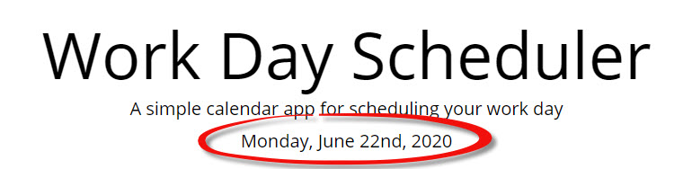
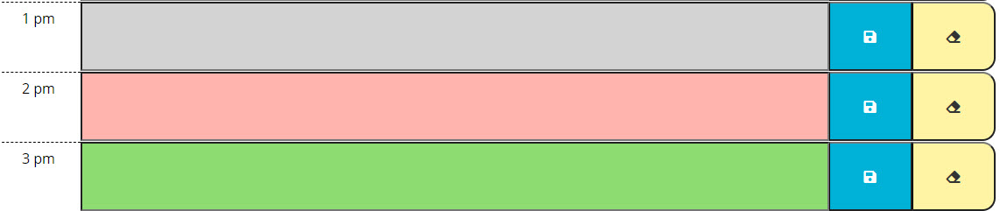
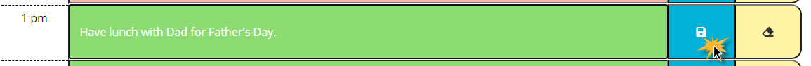
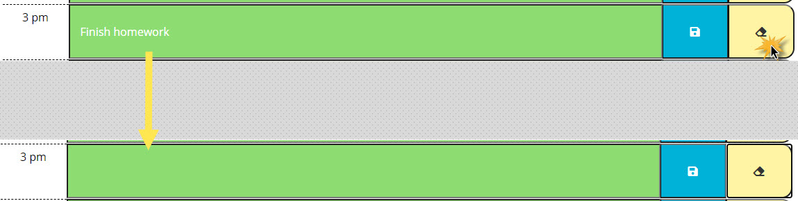

# Welcome to your Day Planner!

Don't miss a single appointment anymore! Track your daily tasks in this handy day planner.

Click here to open the application:  https://cbayley-edu.github.io/homework-week-05/index.html

## Overview of interface

The current date will appear at the top of your planner:

Times that have passed will appear in gray:

The current time will appear in pink:

Future times will appear in green:

## How to use the application

In any available time slot, enter your task and click the Save button:

If you want to clear an entry, simply press the clear button.

